<!-- ============================================================ -->

<!--                       TYPING HEADER                          -->

<!-- ============================================================ -->

  

  

  
  
  

---

## 🧑‍💻 About Me

  🎓 <strong>Computer Science Student</strong>
  &nbsp;|&nbsp;
  💻 <strong>Software Developer</strong>
  &nbsp;|&nbsp;
  📱 <strong>Android Developer</strong>

  I build <strong>scalable web & mobile applications</strong> that solve real-world problems. 
  I enjoy combining <strong>development, automation, AI, and UI</strong> to create useful digital products.

<table align="center">
  <tr>
    <td><strong>🔭 Currently working on</strong></td>
    <td>Full-stack, AI, automation & Android projects</td>
  </tr>
  <tr>
    <td><strong>🌱 Currently learning</strong></td>
    <td>Backend architecture, databases, .NET & scalable systems</td>
  </tr>
  <tr>
    <td><strong>🤝 Open to collaborate</strong></td>
    <td>Web development, mobile apps, AI & open-source projects</td>
  </tr>
  <tr>
    <td><strong>⚡ Fun fact</strong></td>
    <td>I can spend hours refining a UI pixel by pixel.</td>
  </tr>
</table>

---

## 🛠️ Tech Stack

### 💻 Languages

  

### 🌐 Web & Mobile

  

### 🗄️ Backend, Databases & Infrastructure

  

### 🎨 Tools & Platforms

  

---

## 📊 GitHub Analytics

  

---

## 🔥 Contribution Streak

  

---

## 🐍 Contribution Activity

  

---

## 🏆 GitHub Trophies

  

---

## 🚀 Featured Projects

| Project                | Description                                               |                         Repository                         |
| :--------------------- | :-------------------------------------------------------- | :--------------------------------------------------------: |
| **Mina Backend**       | Backend project built for real-world application needs.   |    [View →](https://github.com/sanjeevRae/mina-backend)    |
| **AutoMarket**         | Marketplace automation and deal-alert project.            |     [View →](https://github.com/sanjeevRae/AutoMarket)     |
| **EVOX SaaS Platform** | SaaS platform focused on modern application architecture. | [View →](https://github.com/sanjeevRae/EVOX-SaaS-Platform) |
| **AutoMarket Flutter** | Flutter mobile application for the AutoMarket ecosystem.  | [View →](https://github.com/sanjeevRae/automarket-flutter) |

---

## 🌐 Let's Connect

  

  

  

---

  

